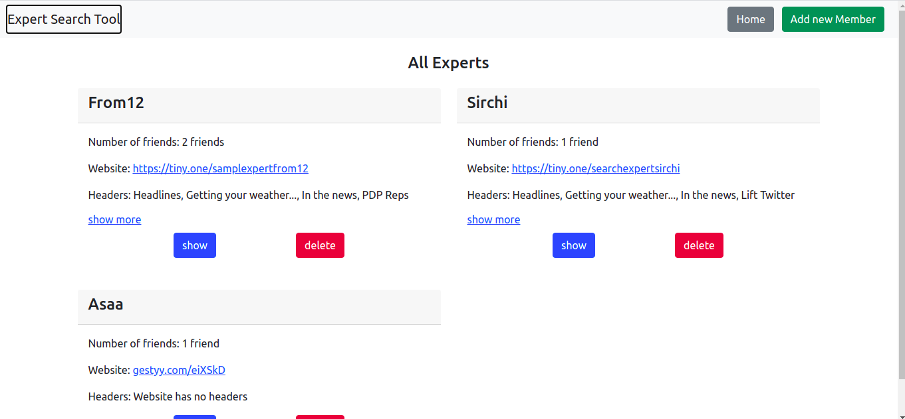

# README

This is a simple expert search tool in rails, members are created with their their name and their personal website, the member's header(h1-h3) is scraped from their page and added to the search tool, which is used to search the database for expert with headers on a particular topic.
<p float = 'left'>
    
</p>

### See the Live version here - > [Live Link](https://peaceful-plateau-62698.herokuapp.com/members/new)

# Built With

- Ruby v2.7.0
- Ruby on Rails v6.0.3
- HTML
- CSS
- Bootstrap
- HTTParty
- Nokogiri
- URI
- Rubocop

  # Features
- create Member
- Add friends and Unfriend
- search for members by headers
- See all members

# Prerequisites

- Ruby: 2.7.1
- Rails: 6.0
- Postgres: >=9.5

# Getting Started

### Get a local copy

`$ git clone https://github.com/Ceejayski/Expert-Search-Tool-in-Rails`

### Initial Setup

- Go to the local repo and run `bundle install`
- Updaate your yarn if its out of date with `yarn install --check-files`
- Install bootstrap with ```yarn add bootstrap jquery popper.js```

### Database Setup:
- First run `rails db:create`
- Then run `rails db:migrate`

### Start server:
- Run `rails server`

- Go to `http://localhost:3000/`


# Author

👤 **Okoli Chijioke**

- Github: [@ceejayski](https://github.com/ceejayski)

- LinkedIn: [LinkedIn](https://www.linkedin.com/in/okoli-ceejay/)


## 🤝 Contributing

Contributions, issues and feature requests are welcome!

Feel free to check the [issues page](https://github.com/Berabjesus/Ethiopia-on-Rails/issues).

## Show your support

Give a ⭐️ if you like this project!

## Acknowledgments

- Microverse
- Heroku
- Nelson Sakwa, The designer of the [Lifestyle Articles](https://www.behance.net/gallery/14554909/liFEsTlye-Mobile-version)

## 📝 License

None
